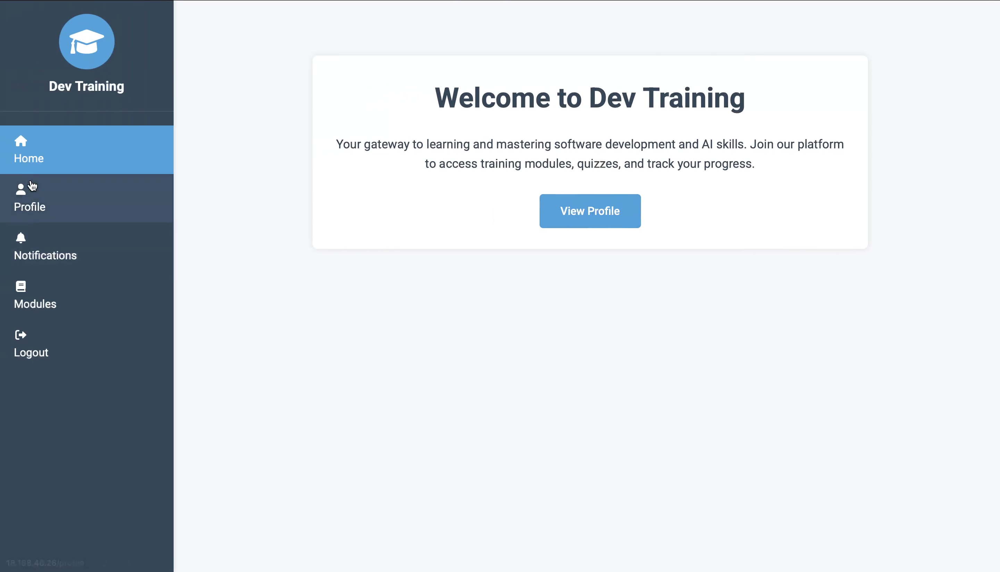
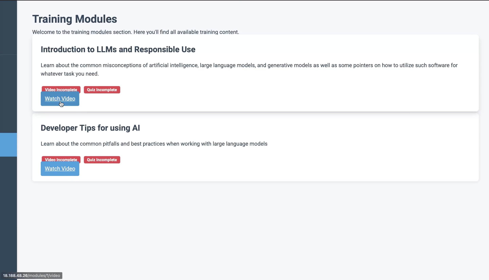
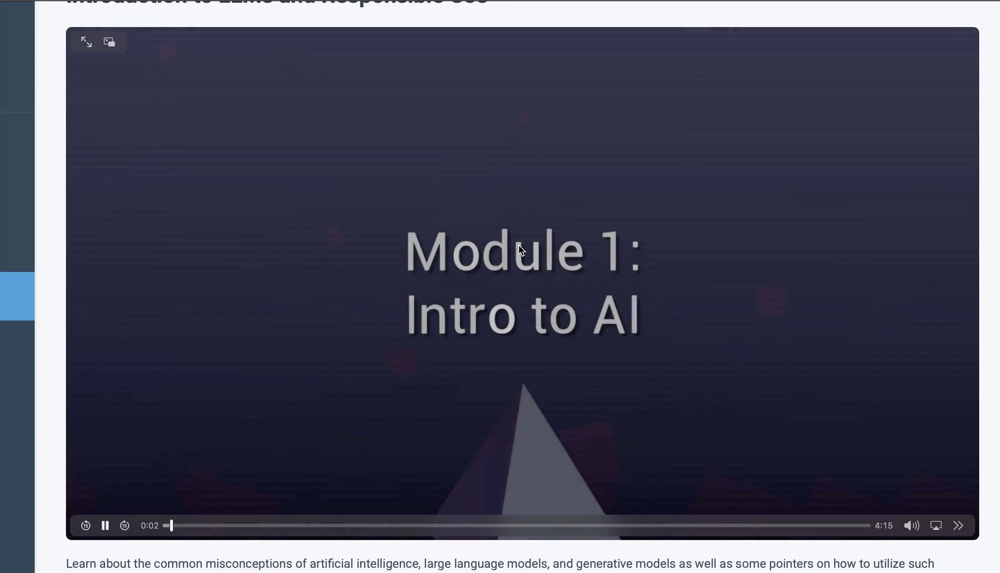
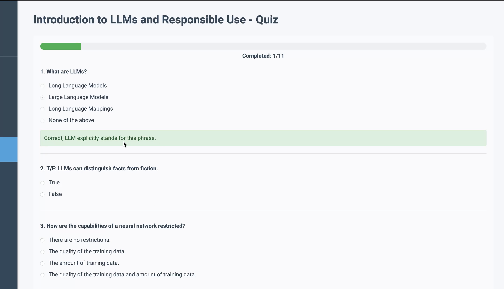
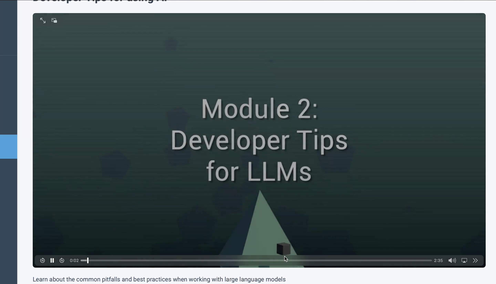
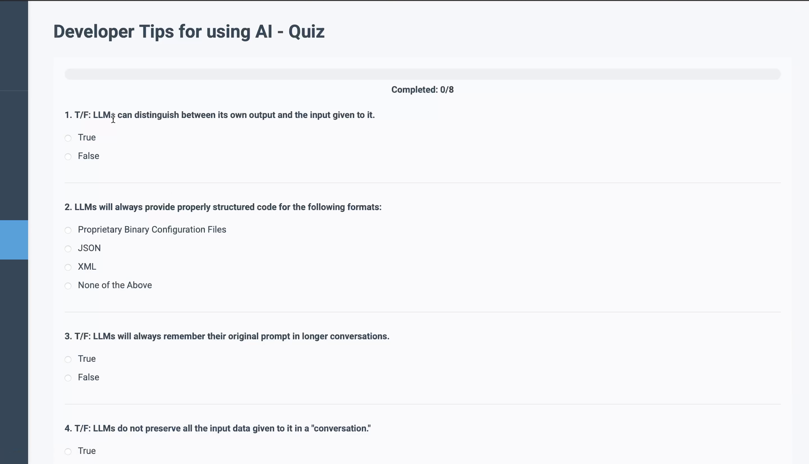
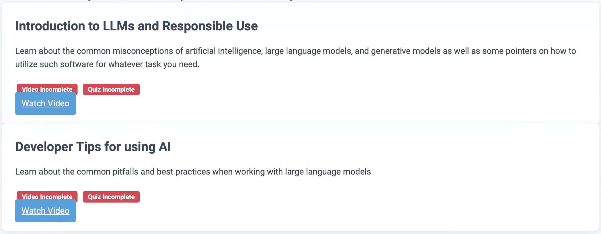
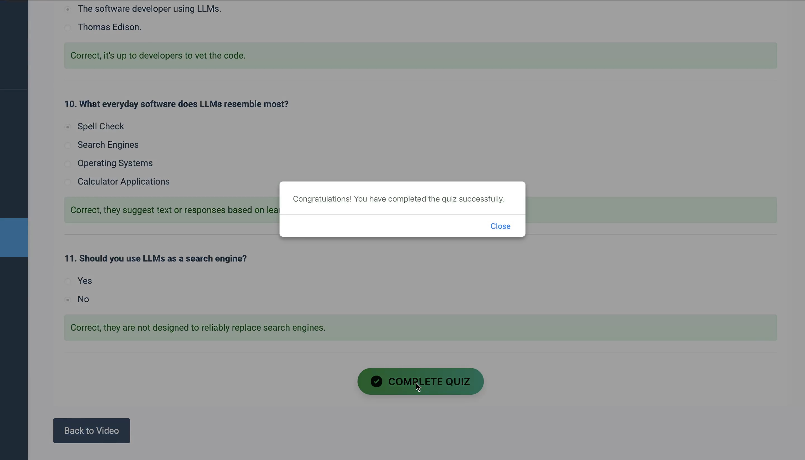
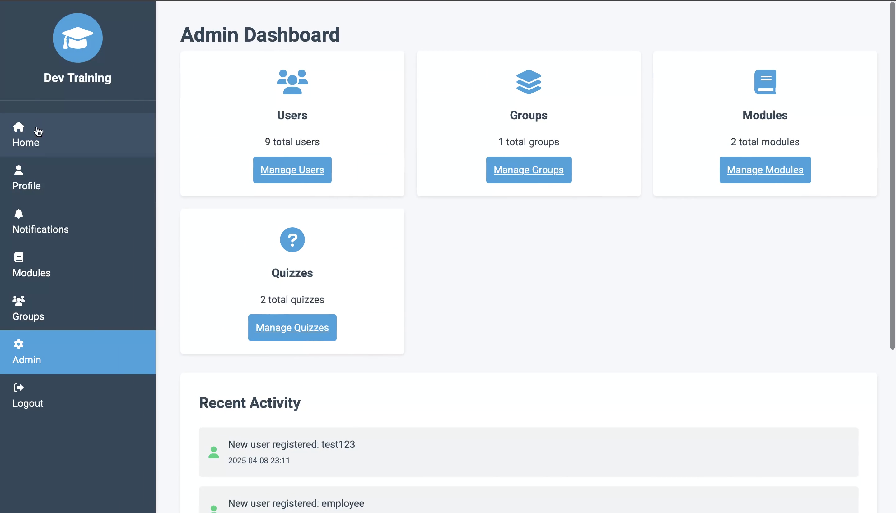
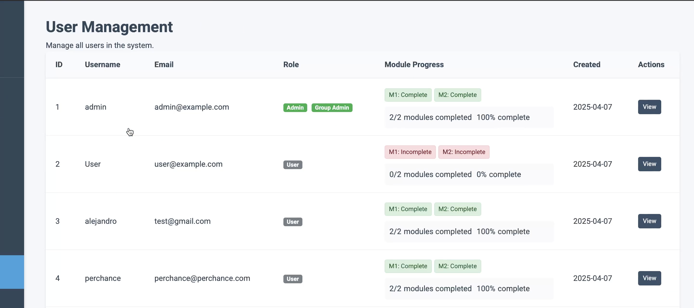

# LLMDevGuide

LLMDevGuide is a web-based educational platform designed to teach professionals and students how to use Large Language Models (LLMs) responsibly and ethically. The platform provides structured, interactive training modules on AI ethics principles—such as fairness, transparency, privacy, and safety—supported by quizzes, progress tracking, and role-based access controls.

## Features

- 📘 **Modular Curriculum**: Self-paced lessons covering core Responsible AI concepts, each paired with interactive quizzes and real-world examples.

- 🧠 **User Progress Tracking**: Learners can monitor their progress, review quiz performance, and earn completion certificates.

- 🛡️ **Role-Based Access Control**: Supports Learners, Group Admins (e.g., team leads/instructors), and Super Admins with tailored permissions and dashboards.

- 📊 **Admin Analytics**: Organizational users can track team engagement and ensure training compliance through detailed reporting tools.

- 📱 **Responsive Design**: Optimized for desktop and mobile for flexible learning access.

## Tech Stack

- **Backend**: Python (Flask)
- **Database**: PostgreSQL
- **Frontend**: HTML/CSS/JavaScript with Bootstrap
- **Server**: Gunicorn + Nginx
- **Deployment**: AWS EC2

## Purpose

LLMDevGuide addresses the growing need for Responsible AI training in organizations by offering an accessible and scalable solution. By equipping users with foundational AI ethics knowledge, it helps mitigate risks associated with biased or unsafe AI use and supports regulatory compliance efforts.

## Usage
For technical details, first visit the [deployment_guide](deployment_guide.md) and then visit provided markdown files in the newsite folder for further details.

## Future Goals

- Add new modules on emerging AI topics
- Integrate gamified learning and adaptive feedback
- Expand to multi-language support and certification partnerships

## License

This project is for academic and educational use. Licensing terms TBD.

